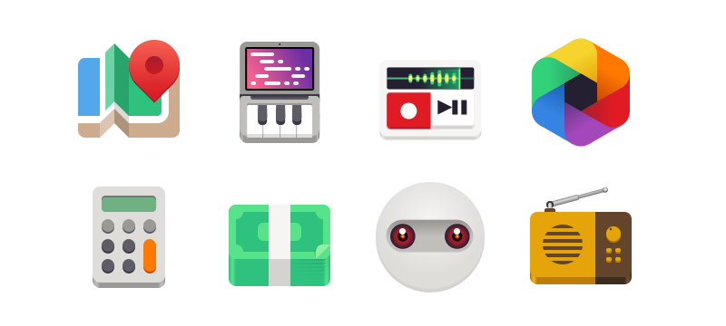
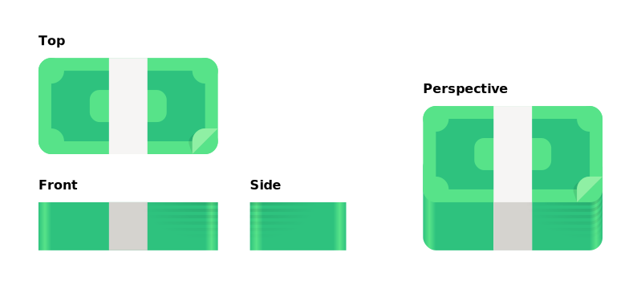
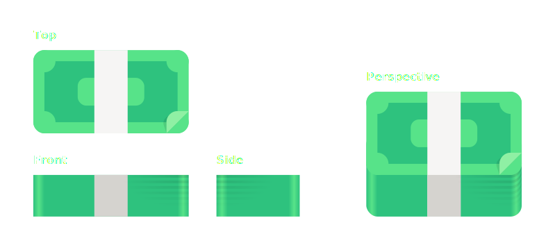
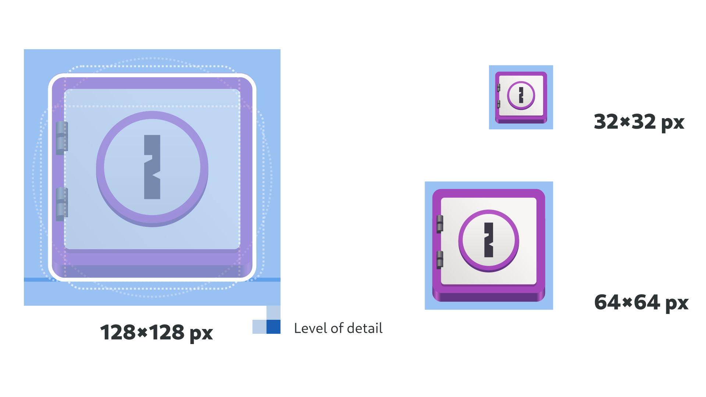
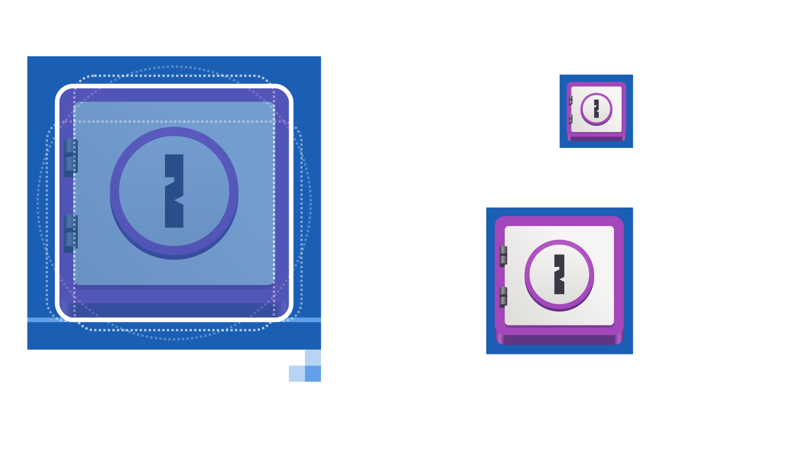
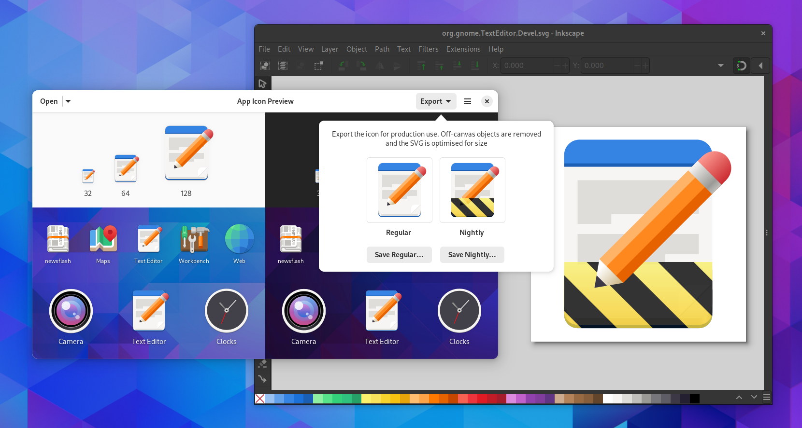

Иконки приложений
=========

In addition to having a :doc:`great name <app-naming>`, every app also needs a great icon. This page provides guidance on how to create one.

Typically, creating an app icon requires pre-existing visual design skills. However, GNOME app icons are deliberately simple in style, in order to make icon creation as accessible as possible.

The `App Icon Preview <https://flathub.org/apps/details/org.gnome.design.AppIconPreview>`_ tool is recommended for app icon creation. It supports each stage of the process, from generating a template, previewing the icon in relevant contexts, and exporting the final assets.

**App icons should be unique to each and every app. Reusing existing icons for app identities is strongly discouraged.**

Metaphor
--------

Each app icon should have a simple, recognizable metaphor. Ideally this should have a clear and obvious relationship with the :doc:`app name <app-naming>`. Common types of metaphors include:

* Physical objects directly related to what the app does (for example, a speaker for a music app).
* Physical objects which are at least somewhat related to the app’s domain, or to an older analog version of it (for example, a cassette tape for a podcasting app).
* Symbols related to the domain (for example, the “play” triangle for a video player).
* If the app has a distinctive UI, a simplified, stylized version of it.

Avoid metaphors that are unrelated to the name or function of the app, such as using characters or mascots. Also avoid using logos which rely on a specific visual style.

GNOME App Icon Style
--------------------

The GNOME app icon style is simple and geometric. In many cases you can draw an entire icon with only basic shapes.

Size & Shape
~~~~~~~~~~~~

App icons are drawn within a 128×128px area, but shouldn't fill this space. When judging how large to draw the icon, follow the guides in the `app icon template <https://gitlab.gnome.org/Teams/Design/HIG-app-icons/blob/master/template.svg>`_, and ensure that your icon has a similar visual weight to other app icons.

* Avoid extreme aspect ratios for the icon shape, such as very narrow or very wide shapes.
* The bottom of the icon should be aligned against the standard baseline, which is indicated in the template.

Perspective
~~~~~~~~~~~

While the app icon style is simple, it is not “flat”. Depth is introduced by combining the “top” and “front” of the object, so that each icon has an additional profile at the bottom of the object. This “front” profile is shaded darker than the top surface.

In most cases the profile is subtle, not taller than `2 detail units` (`4 nominal pixels`). But as the example aboves show there can be exceptions.

Material & Lighting
~~~~~~~~~~~~~~~~~~~

Icons can make use of skeuomorphic materials (for example: wood, metal, or glass) if required. Otherwise, simple colors and textures are recommended. Use the :doc:`standard color palette </reference/palette>` as a base for colors.

Straight surfaces should have flat colors, with gradients being reserved for curved surfaces.

.. image:: ../img/icons/app-icon-preview.png

Shadows should be avoided if possible, but can be used if it is necessary to give contrast to different icon elements. When drawing shadows, the light source should point straight down from above. Do not draw shadows outside the main silhouette of the icon, as these are generated programmatically based on the context.

Detail
~~~~~~

App icons are defined at 128×128px, but are typically viewed at 64×64px, and can be scaled down to 32×32px. Therefore, avoid adding too much detail, as this will be lost at small sizes.

The template includes a 2px grid which should be followed, and will help to avoid adding excess details.

Symbolic App Icons
------------------

Each app should have an additional symbolic version of its app icon, which is used to represent the app icon at smaller sizes, and in some special contexts. A description of the symbolic icon style can be found in the :doc:`UI icons guidelines <ui-icons>`.

App symbolics can be drawn in the same SVG as the full-size app icon, as indicated in the app icon template. App Icon Preview will export both the full-size and symbolic versions of the icon.

Where possible, the same metaphor as the full size app icon should be used for the symbolic.

Nightly Variant
---------------

If you provide a nightly or beta build of your app, it is recommended to create a specific version of the app icon for it so it is possible to tell them apart.

`App Icon Preview <https://flathub.org/apps/details/org.gnome.design.AppIconPreview>`_ is able to generate a nightly variant of the icon automatically. In some cases it may be desirable to adjust the output manually, though in most cases this shouldn't be necessary.

