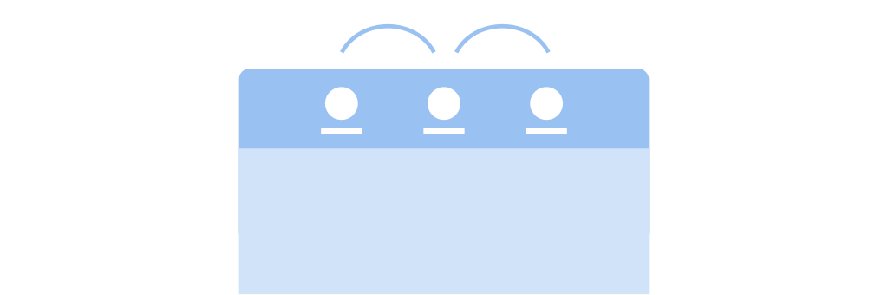
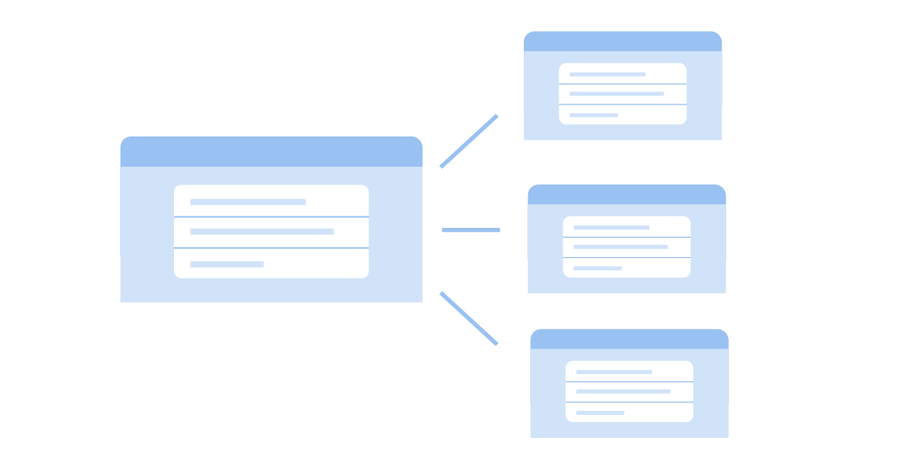
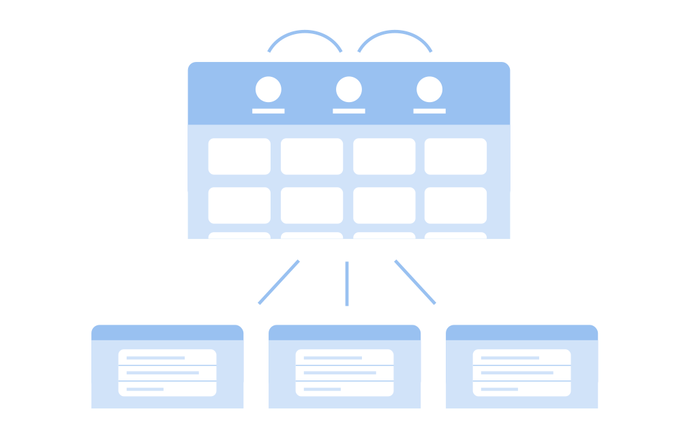

Навигация
==========

While some apps only need a single view in which to show their UI, most need to be broken down into a series of views or windows. The :doc:`navigation </patterns/nav>` and :doc:`containers </patterns/containers>` patterns cover the most common design options for doing this. This page provides some general guidance on how to put them together.

Window-Based Navigation
-----------------------

Different views can either be shown in a single window, with design patterns which allow moving between views in place, or they can be shown in secondary windows which are shown above the window. Deciding which to use is a matter of:

* fitting the content you have to an appropriately sized container
* observing :doc:`general guidelines </patterns/containers/windows>`, such as avoiding stacking secondary windows
* in some cases, following convention, such as for preferences and about windows

These guidelines notwithstanding, showing multiple views inside an existing window is generally preferable to showing new windows, since it results in a smoother experience. This is particularly true of any content or functionality which is central to the purpose of the app.

Simple Navigation
-----------------

A number of design patterns support simple navigation with a small number of views.

Flat Navigation
~~~~~~~~~~~~~~~

The simplest navigation design pattern is the :doc:`view switcher </patterns/nav/view-switchers>`, which allows having a small number of equivalent pages within a single window. This can often be sufficient for apps which have different types of information or controls to display.

View switchers have a flat navigation structure - each page is equivalent in importance, and can be opened from any of the others.

:doc:`Sidebars </patterns/nav/sidebars>` are another flat navigation pattern, which can be used if there are too many pages to be accommodated within a view switcher.

These flat navigation patterns can be combined with other common navigation patterns. For example, view switchers can be used in sidebar locations, or in secondary windows.

Hierarchical Navigation
~~~~~~~~~~~~~~~~~~~~~~~

In hierarchical navigation, a parent view provides links to multiple sub-views. The parent view can be a grid of images or a list, and each sub-view can be either a secondary window or a different view which is shown in the same window as the parent. Moving between parent and sub-view is accomplished with :doc:`browsing </patterns/nav/browsing>`.

Hierarchical navigation is appropriate when it is desirable to provide an "overview" which shows multiple items, such as a collection of photos, or a summary of app settings.

Complex Navigation
------------------

The types of navigation structure described above can be used on their own, and this is appropriate for relatively simple structures. However, for more complex cases with content of varying types, it is often necessary to combine them into more elaborate arrangements.

Here, one common design pattern is to combine flat top-level navigation with hierarchical navigation below. This makes it possible to browse categories of content items.

Guidelines
----------

* Ensure that the amount of content in each view is easy to digest: don't pack too much in.
* Each view should have a clear focus or subject.
* Don't overcomplicate navigation by combining multiple navigation types in non-standard ways. Keep it simple.
* Avoid deeply nested hierarchies. As a rule, hierarchies should generally only have one level of depth.
* Support the :ref:`standard keyboard shortcuts for navigation <navigation-shortcuts>`.
