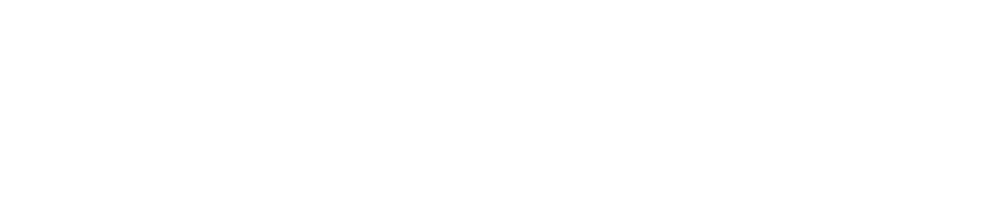

UI Icons
========

This page provides general guidance on UI icon usage: when to use them, which ones to use, how to find them, and how to create them.

UI Icon Style
-------------

GNOME UI icons use the “symbolic” style. This is simple and monochrome and is designed to work well at smaller sizes. Symbolics are drawn as 16×16px SVGs and can be used at 32×32px, 64×64px and 128×128px. Avoid other sizes to prevent fuzzy rendering.

All or part of the icon can be programmatically recolored.

The other style of icon found in GNOME is the full-color icon style, which is primarily used for :doc:`app icons <app-icons>`. Full-color icons can be used for UI icons that are displayed at large sizes and are intended to be the focus of attention. File and folder icons in a file manager are one example of this.

Finding UI Icons
----------------

GTK includes a set of symbolic icons, which are automatically available to apps. Additionally, the Icon Dev Kit provides a collection of icons which can be copy/pasted into your app. Both sources of icons are included in the `Icon Library app <https://flathub.org/apps/details/org.gnome.design.IconLibrary>`_. This allows all available symbolic icons to be browsed and searched, and provides instructions for how to make use of each one.

Where possible, it is recommended to reuse these existing icons, as opposed to creating your own.

When to Use UI Icons
--------------------

As a general rule, controls should be identified with either a label or an icon, and not both. This helps to avoid information overload, particularly when controls are tightly packed together. However, there are some exceptions to this rule, where an icon and label can/should be used in combination. These include locations in :doc:`sidebars </patterns/nav/sidebars>` and :doc:`view switchers </patterns/nav/view-switchers>`.

The most common usage for UI icons is to identify buttons. Here, it is often preferable to use an icon over a label. However, this should be only done if the icon will be recognized by your users. The number of commonly recognized icons is actually quite small, and is dictated by convention. It includes standard icons such as search, menu, forward, back and share. If you are in doubt, only use icons which are frequently used in other apps.

Other icons can also be recognized within specific domains: users of specialist tools will often be familiar with domain-specific symbols.

Note that some icons will only be recognized as part of a set or pair. For example, a media icon for stop is simply a square, and will not be recognized as “stop” without other media symbols  (play, pause, skip, and so on) also being present. Likewise, the “remove” icon is a subtract symbol (in other words, a horizontal line), and will not be recognized without a corresponding “add” icon.

If your users will not recognize an icon, it might be better to use a text label instead.

Symbolic Icon Creation
----------------------

If you require an icon that doesn't already exist, it is possible to create your own. For this, it is recommended to use the `Symbolic Preview app <https://flathub.org/apps/details/org.gnome.design.SymbolicPreview>`_. This will both generate an SVG template to start with, and allows previewing how your icon will appear in different contexts.

When drawing symbolic icons, stick to the characteristics of the symbolic icon style:

* 16×16px nominal size, including a margin to allow for uniqueness of shape and consistency of visual weight.
* No perspective - use a simple orthogonal view.
* 2px strokes for the main features of the icon, with 1px strokes avoided where possible.
* Defined in monochrome, then programmatically recolored.

General guidelines for symbolic icon creation:

* When looking for an appropriate metaphor for an icon, identify a single property to communicate. For example, when describing an action to be performed on an image, it isn’t necessary to repeat the idea of an image in every icon. Instead, focus on what is distinct about each action (for example: rotate, tag, align).
* Align all shapes to the pixel grid to ensure sharp rendering.
* When a metaphor relies on negative space, make sure it will work with the colors inverted. For example a camera lens spec/highlight will only work if lighter than the lens itself.

